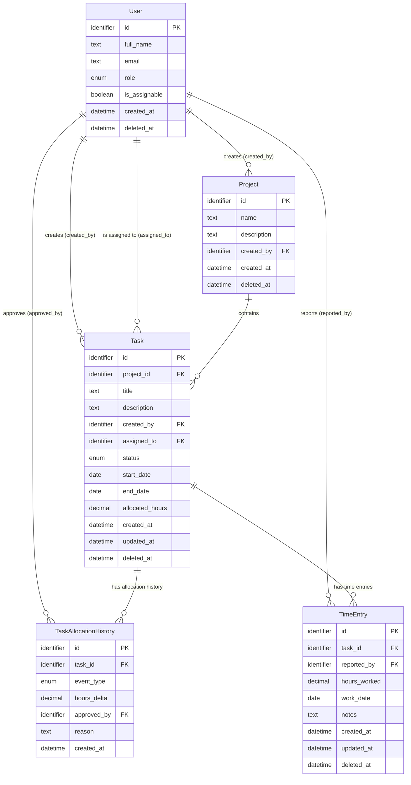

# Klingit Task Management System — Data Model

This document is the complete, language-neutral data model brief for the Klingit Task Management System. It is written to be consumed directly by an AI development agent with no additional context required.

---

## Assumptions

The following assumptions were made where the requirements left room for interpretation:

1. **Users** are a single pool. Role (`project_manager` or `team_member`) is an attribute of the user record, not a separate entity.
2. **"Almost anyone with very few exceptions"** is modelled as a boolean flag (`is_assignable`) on each user. The default is `true` (eligible). Exceptions are explicitly set to `false`.
3. A **Project** entity is introduced as the logical container for tasks. The requirements reference "project managers" and imply grouping, so this entity is made explicit to support project-level reporting and PM ownership.
4. A task has **exactly one assignee** at a time. Multiple concurrent assignees are not described and are out of scope.
5. **Time extensions** are recorded in an append-only history log, not by mutating the original allocation. The `Task.allocated_hours` field reflects the running total at any point.
6. **Time entries** are the atomic unit of time reporting — one entry per work session per task.
7. All `datetime` values are stored in UTC.
8. All entities use **soft-delete** (`deleted_at` timestamp). Hard deletes are not permitted. All normal read queries must filter `deleted_at IS NULL`.

---

## ER Diagram



---

## Entity Definitions

---

### Entity: `User`

Represents every person in the organisation who can interact with the system.

| Attribute | Type | Constraints / Notes |
|---|---|---|
| `id` | identifier | Primary key. System-generated. Unique. Non-null. |
| `full_name` | text | Non-null. Non-empty. |
| `email` | text | Non-null. Unique across all users. Must be a valid email address format. |
| `role` | enum: `project_manager`, `team_member` | Non-null. Determines what actions the user may perform. |
| `is_assignable` | boolean | Non-null. Default `true`. Set to `false` for users who must not be assigned tasks. |
| `created_at` | datetime | Non-null. System-set at creation. UTC. |
| `deleted_at` | datetime | Nullable. When non-null, the user is soft-deleted and must be excluded from all active queries. |

**Business rules:**
- Only users with `role = project_manager` may create projects, create tasks, or approve time-allocation extensions.
- A task may only be assigned to a user where `is_assignable = true` AND `deleted_at IS NULL`.
- A soft-deleted user (`deleted_at` is non-null) may not be assigned new tasks, but their historical records (time entries, tasks) must be preserved.

---

### Entity: `Project`

A logical container that groups related tasks. Owned and created by a project manager.

| Attribute | Type | Constraints / Notes |
|---|---|---|
| `id` | identifier | Primary key. System-generated. Unique. Non-null. |
| `name` | text | Non-null. Non-empty. |
| `description` | text | Nullable. Free-text description of the project. |
| `created_by` | identifier | Foreign key → `User.id`. Non-null. Must reference a user with `role = project_manager`. |
| `created_at` | datetime | Non-null. System-set at creation. UTC. |
| `deleted_at` | datetime | Nullable. Soft-delete flag. |

**Business rules:**
- `created_by` must reference a user with `role = project_manager` at the time of creation.
- A soft-deleted project still owns its tasks for historical record purposes, but no new tasks may be created under a soft-deleted project.
- A project may have zero or more tasks.

---

### Entity: `Task`

The core work item. Created by a project manager within a project.

| Attribute | Type | Constraints / Notes |
|---|---|---|
| `id` | identifier | Primary key. System-generated. Unique. Non-null. |
| `project_id` | identifier | Foreign key → `Project.id`. Non-null. The project this task belongs to. |
| `title` | text | Non-null. Non-empty. |
| `description` | text | Nullable. |
| `created_by` | identifier | Foreign key → `User.id`. Non-null. Must reference a user with `role = project_manager`. |
| `assigned_to` | identifier | Foreign key → `User.id`. Nullable. Null means the task is unassigned. When non-null, must reference a user where `is_assignable = true` AND `deleted_at IS NULL`. |
| `status` | enum: `draft`, `assigned`, `in_progress`, `completed`, `cancelled` | Non-null. Default `draft`. See status transition rules below. |
| `start_date` | date | Non-null. The planned start date of the task. |
| `end_date` | date | Non-null. The planned end date. Must be ≥ `start_date`. Same-day tasks (`end_date = start_date`) are explicitly valid and represent work scoped to a single calendar day. |
| `allocated_hours` | decimal | Non-null. Must be > 0. Represents the current total approved hours (original allocation plus all approved extensions). This field is maintained automatically by the allocation history workflow and must never be edited directly. |
| `created_at` | datetime | Non-null. System-set at creation. UTC. |
| `updated_at` | datetime | Non-null. System-set on every modification. UTC. |
| `deleted_at` | datetime | Nullable. Soft-delete flag. |

**Business rules:**

- `end_date >= start_date` — must be enforced at every write (create and update). `end_date = start_date` is valid (single-day task).
- `allocated_hours > 0` — must be enforced at every write. This field is derived from `TaskAllocationHistory` and must only be updated as part of the allocation/extension workflow.
- `assigned_to` may only reference a user where `is_assignable = true` AND `deleted_at IS NULL`. Setting `assigned_to` to any other value must be rejected.
- Only a user with `role = project_manager` may create a task or set a task's status to `cancelled`.

**Status transition rules (enforced at every status update):**

```
draft → assigned        (triggered when assigned_to is first set on a draft task)
assigned → in_progress  (triggered when the first TimeEntry is created for the task)
in_progress → completed (explicit action by a project_manager)
draft → cancelled       (explicit action by a project_manager)
assigned → cancelled    (explicit action by a project_manager)
in_progress → cancelled (explicit action by a project_manager)
```

- `completed` and `cancelled` are terminal states. No further status changes are permitted once a task reaches either.
- If `assigned_to` is set while a task is in `draft` status, status automatically transitions to `assigned`.
- If `assigned_to` is changed while a task is already `in_progress`, status remains `in_progress`.

---

### Entity: `TaskAllocationHistory`

Append-only log of every hour-allocation event on a task. Captures both the original allocation (at task creation) and every subsequent extension approved by a PM.

| Attribute | Type | Constraints / Notes |
|---|---|---|
| `id` | identifier | Primary key. System-generated. Unique. Non-null. |
| `task_id` | identifier | Foreign key → `Task.id`. Non-null. |
| `event_type` | enum: `initial`, `extension` | Non-null. `initial` is written exactly once per task at creation time. `extension` is written each time a PM approves additional hours. |
| `hours_delta` | decimal | Non-null. Must be > 0. The number of hours added in this event. |
| `approved_by` | identifier | Foreign key → `User.id`. Non-null. Must reference a user with `role = project_manager`. |
| `reason` | text | Nullable. Free-text rationale for the extension. Recommended for `extension` events; optional for `initial`. |
| `created_at` | datetime | Non-null. System-set at creation. UTC. |

**Business rules:**

- Exactly **one** `initial` record must exist per task. It is created atomically with the task. No second `initial` record may ever be created for the same task.
- `approved_by` must always reference a user with `role = project_manager`, for both `initial` and `extension` events.
- An `extension` record may only be created when `Task.status` is `assigned` or `in_progress`. Extensions on `draft`, `completed`, or `cancelled` tasks must be rejected.
- Records in this table are **immutable** once written — no updates or deletes (including soft-deletes) are permitted.
- After each successful insert of a `TaskAllocationHistory` record, `Task.allocated_hours` must be incremented by `hours_delta` (and `Task.updated_at` refreshed). These two writes must happen atomically (in the same transaction).

---

### Entity: `TimeEntry`

Records a single instance of a user reporting hours worked against a task.

| Attribute | Type | Constraints / Notes |
|---|---|---|
| `id` | identifier | Primary key. System-generated. Unique. Non-null. |
| `task_id` | identifier | Foreign key → `Task.id`. Non-null. |
| `reported_by` | identifier | Foreign key → `User.id`. Non-null. Must equal `Task.assigned_to` at the time of entry creation. |
| `hours_worked` | decimal | Non-null. Must be > 0. |
| `work_date` | date | Non-null. The calendar date on which the work was performed. Must be ≥ `Task.start_date` and ≤ `Task.end_date`. |
| `notes` | text | Nullable. Optional description of work done in this session. |
| `created_at` | datetime | Non-null. System-set at creation. UTC. |
| `updated_at` | datetime | Non-null. System-set on every modification. UTC. |
| `deleted_at` | datetime | Nullable. Soft-delete flag. Used for corrections (see rules below). |

**Business rules:**

- `reported_by` must equal `Task.assigned_to` at the moment the entry is created. If the task is unassigned or the reporter is not the current assignee, the entry must be rejected.
- `hours_worked > 0` — enforced at every write.
- `work_date` must be ≥ `Task.start_date` and ≤ `Task.end_date` — enforced at creation.
- A time entry may only be created when `Task.status` is `assigned` or `in_progress`.
- Creating the **first** time entry for a task (where `Task.status = assigned`) must automatically transition `Task.status` to `in_progress`.
- A time entry cannot be updated after creation. To correct an error, soft-delete the incorrect entry and create a new one.
- For reporting, only active entries (`deleted_at IS NULL`) count toward total hours logged.
- When the sum of active `hours_worked` for a task **strictly exceeds** `Task.allocated_hours` (i.e., `total_logged > allocated_hours`), the task is considered **over-budget**. A task that has logged exactly its allocation is considered on-budget. The system must allow the over-budget state to occur (it is not blocked) but must make it visible in reporting queries.

---

## Relationships & Cardinalities

| From | To | Foreign Key | Type | Notes |
|---|---|---|---|---|
| `User` | `Project` | `Project.created_by` | one-to-many | One PM creates zero or more projects |
| `Project` | `Task` | `Task.project_id` | one-to-many | One project contains zero or more tasks |
| `User` | `Task` | `Task.created_by` | one-to-many | One PM creates zero or more tasks |
| `User` | `Task` | `Task.assigned_to` | one-to-many | One user can be the assignee on zero or more tasks; each task has at most one assignee |
| `Task` | `TaskAllocationHistory` | `TaskAllocationHistory.task_id` | one-to-many | One task has one or more allocation events (minimum one `initial`) |
| `User` | `TaskAllocationHistory` | `TaskAllocationHistory.approved_by` | one-to-many | One PM approves zero or more allocation events |
| `Task` | `TimeEntry` | `TimeEntry.task_id` | one-to-many | One task has zero or more time entries |
| `User` | `TimeEntry` | `TimeEntry.reported_by` | one-to-many | One user logs zero or more time entries |

---

## Constraints & Business Rules — Complete Reference

The following table is a consolidated reference. Every rule listed here must be enforced by the application.

| Rule | Enforced On | Detail |
|---|---|---|
| `Task.end_date >= Task.start_date` | Task create & update | Reject writes where end_date < start_date |
| `Task.allocated_hours > 0` | Task create & update | Reject writes where allocated_hours ≤ 0 |
| `TimeEntry.hours_worked > 0` | TimeEntry create | Reject writes where hours_worked ≤ 0 |
| `TaskAllocationHistory.hours_delta > 0` | AllocationHistory insert | Reject writes where hours_delta ≤ 0 |
| Only assignable, non-deleted users may be assigned | Task `assigned_to` write | Check `User.is_assignable = true` AND `User.deleted_at IS NULL` |
| Only PMs may create tasks | Task create | Check `Task.created_by` user has `role = project_manager` |
| Only PMs may create projects | Project create | Check `Project.created_by` user has `role = project_manager` |
| Only PMs may cancel tasks | Task status update to `cancelled` | Check requesting user has `role = project_manager` |
| Only PMs may approve extensions | AllocationHistory insert | Check `approved_by` user has `role = project_manager` |
| Only PMs may mark tasks completed | Task status update to `completed` | Check requesting user has `role = project_manager` |
| `reported_by` must be current `assigned_to` | TimeEntry create | Reject if `TimeEntry.reported_by ≠ Task.assigned_to` |
| `work_date` within task date range | TimeEntry create | Reject if `work_date < Task.start_date` OR `work_date > Task.end_date` |
| Status transitions follow defined graph | Task status update | See status transition rules in the Task section |
| `completed` and `cancelled` are terminal | Task status update | Reject any status change from these states |
| Exactly one `initial` allocation per task | AllocationHistory insert | Reject a second `initial` insert for the same `task_id` |
| Extensions only on active tasks | AllocationHistory insert (`extension`) | Reject if `Task.status` is not `assigned` or `in_progress` |
| Time entries only on active tasks | TimeEntry create | Reject if `Task.status` is not `assigned` or `in_progress` |
| First time entry triggers `in_progress` | TimeEntry create | If `Task.status = assigned` and this is the first TimeEntry, set `Task.status = in_progress` |
| `allocated_hours` incremented on extension | AllocationHistory insert | Atomically increment `Task.allocated_hours` by `hours_delta` on each insert |
| AllocationHistory records are immutable | AllocationHistory | No updates or deletes permitted on this table |
| Soft-delete on all entities (except AllocationHistory) | All entities | Deleted records have `deleted_at` set to current UTC time; all active queries filter `deleted_at IS NULL` |
| No new tasks under a deleted project | Task create | Reject if `Project.deleted_at IS NOT NULL` |

---

## Reporting Queries

The model is designed to answer the following business queries directly without additional denormalisation.

**Q1: How many hours has person X worked on project Y?**
```
SUM(TimeEntry.hours_worked)
WHERE TimeEntry.reported_by = X
  AND TimeEntry.task_id IN (Task.id WHERE Task.project_id = Y)
  AND TimeEntry.deleted_at IS NULL
```

**Q2: Which tasks are over budget?**
```
SELECT Task.id, Task.title, Task.allocated_hours,
       SUM(TimeEntry.hours_worked) AS total_logged
FROM Task
JOIN TimeEntry ON TimeEntry.task_id = Task.id AND TimeEntry.deleted_at IS NULL
WHERE Task.deleted_at IS NULL
GROUP BY Task.id
HAVING SUM(TimeEntry.hours_worked) > Task.allocated_hours
```

**Q3: Full extension history for task Z?**
```
SELECT * FROM TaskAllocationHistory
WHERE task_id = Z
ORDER BY created_at ASC
```

**Q4: Resource utilisation across a date range?**
```
SELECT TimeEntry.reported_by, SUM(TimeEntry.hours_worked)
FROM TimeEntry
WHERE TimeEntry.work_date >= [start] AND TimeEntry.work_date <= [end]
  AND TimeEntry.deleted_at IS NULL
GROUP BY TimeEntry.reported_by
```

**Q5: All tasks currently assigned to person X?**
```
SELECT * FROM Task
WHERE assigned_to = X
  AND status IN ('assigned', 'in_progress')
  AND deleted_at IS NULL
```

> Note: The pseudo-SQL above is for human readability only and illustrates intent. The agent should implement equivalent queries in whatever query language suits the chosen stack.

---

## Design Rationale & Trade-offs

### 1. Append-only `TaskAllocationHistory` vs. a single mutable `allocated_hours` field

A single mutable field on `Task` would satisfy most read queries efficiently, but would lose all audit history of extensions. The append-only log preserves full traceability. `Task.allocated_hours` is maintained as a running total on each insert so that the common case (reading current allocation) remains a single-field lookup with no aggregation.

### 2. `role` as an enum on `User` vs. a separate `Role` entity

The two described roles (`project_manager`, `team_member`) are stable and behaviourally distinct. A simple enum avoids an unnecessary join on every authorisation check. If roles become more granular or dynamic in future, extracting to a `Role` entity is a straightforward migration.

### 3. `is_assignable` flag vs. a separate exclusion table

A boolean flag is simpler, more readable in queries, and performs better than a join to an exclusion table. The requirement explicitly frames this as a rare exception, so a flag cleanly expresses the intent without over-engineering.

### 4. Single assignee per task

The requirements consistently use singular language ("assigned to"). Supporting multiple concurrent assignees would require a junction table and would make the time-entry ownership rule (only the assignee reports time) ambiguous. Single assignee keeps the model clean. If this changes, adding a `TaskAssignment` junction table is a well-defined extension.

### 5. Soft deletes on all entities except `TaskAllocationHistory`

Soft deletes preserve historical time entries and task records, which is essential for accurate reporting and audit. `TaskAllocationHistory` is fully immutable (no deletes at all) because it is the audit log of financial-adjacent allocation decisions.

### 6. `Project` entity made explicit

The case study references "project managers" and implies task grouping, but never formally defines a project entity. Making it explicit enables project-level reporting (e.g., "total hours per project"), supports PM ownership at the project level, and does not add meaningful complexity to the model.

### 7. `Task.updated_at` is always system-managed

`updated_at` must be set by the system on every write and must never be user-controlled. This is important for detecting stale-read issues and for any eventual caching or replication scenarios.
